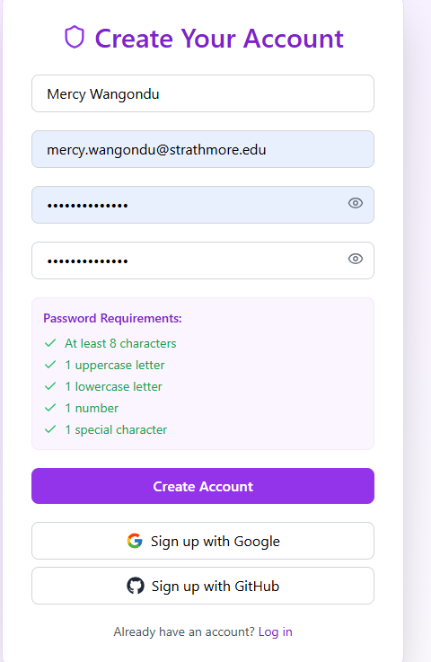
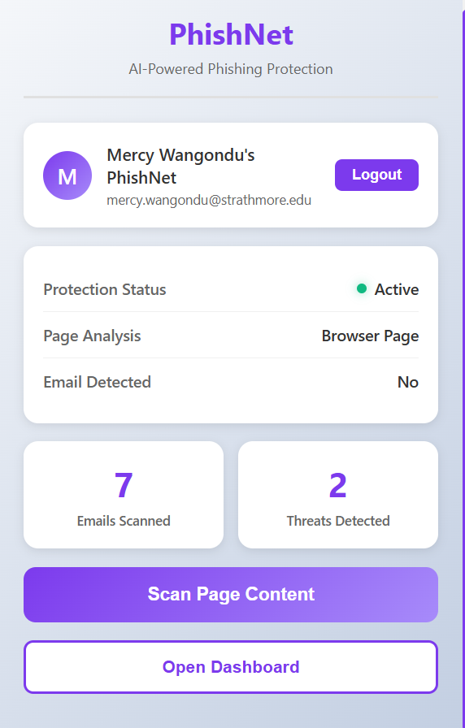
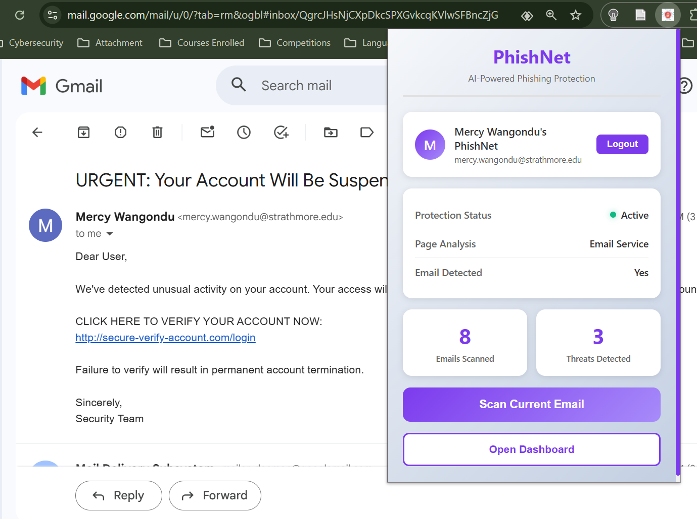
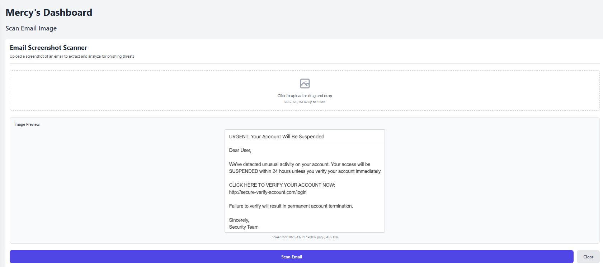
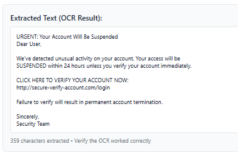
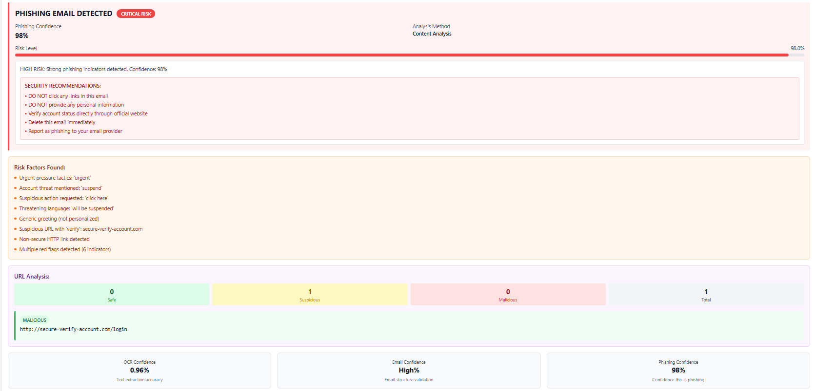
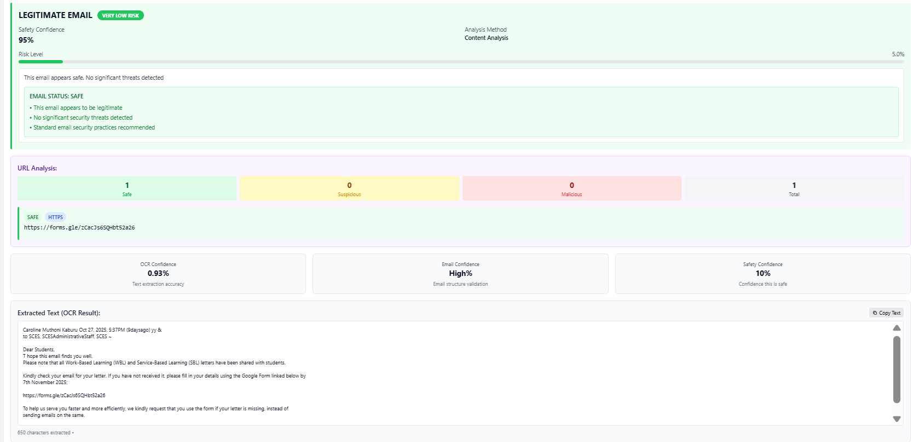
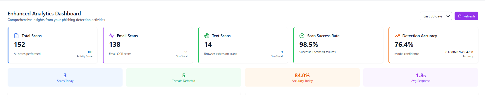

<div align="center">


#  PhishNet
### On-Demand Browser extension for Email Phishing Detection Using BERT

> *Intelligent, lightweight phishing protection — built right into your browser.*

[](https://python.org)
[](https://reactjs.org)
[](https://fastapi.tiangolo.com)
[](https://huggingface.co)
[](https://postgresql.org)
[](https://firebase.google.com)
[]()

<br/>

**98.28% Detection Accuracy &nbsp;·&nbsp; 1.8s Average Scan Time &nbsp;·&nbsp; 22/22 Tests Passed**

</div>

---

##  Table of Contents

- [Overview](#-overview)
- [The Problem](#-the-problem)
- [Key Features](#-key-features)
- [Demo](#-demo)
- [Architecture](#-system-architecture)
- [Tech Stack](#-tech-stack)
- [Model Performance](#-model-performance)
- [Screenshots](#-screenshots)
- [Getting Started](#-getting-started)
- [Project Structure](#-project-structure)
- [Testing](#-testing)
- [Roadmap](#-roadmap)
- [Contributing](#-contributing)
- [Author](#-author)

---

##  Overview

**PhishNet** is an AI-powered, on-demand phishing detection system deployed as a **Google Chrome browser extension**. It combines **BERT-based Natural Language Processing** with **Tesseract OCR** to detect phishing threats in both text-based emails and image-based content — directly within the browser, without requiring enterprise-grade infrastructure.

Developed as a final-year project at **Strathmore University, Nairobi**, PhishNet closes the accessibility gap in cybersecurity tools for individuals, students, and small organizations.

---

##  The Problem

> Phishing accounted for **36% of all data breaches** in 2023 *(Verizon DBIR, 2023)*. Yet most detection tools are built for enterprises — expensive, complex, and inaccessible to everyday users.

| Gap in Existing Tools | How PhishNet Solves It |
|---|---|
| Enterprise-only tools with paywalled features | Free, open, browser-native detection |
| No support for image-based phishing | Tesseract OCR extracts text from email screenshots |
| Manual copy-paste workflows | One-click on-demand scanning inside the browser |
| AI-generated phishing bypasses keyword filters | BERT understands semantic context, not just keywords |
| High false positive rates | 1.1% false positive rate achieved in testing |

---

##  Key Features

- **BERT-Powered Detection** — DistilBERT fine-tuned on 35,000+ real phishing and legitimate emails for deep semantic understanding
- **OCR Email Scanning** — Upload a screenshot of a suspicious email; Tesseract extracts the text and feeds it directly into the AI detection pipeline
- **Chrome Browser Extension** — One-click activation on any webmail page (Gmail, Outlook, etc.)
- **Risk Scoring Dashboard** — Phishing confidence score, danger rating, URL analysis, and actionable security recommendations per scan
- **Secure Auth** — Firebase Authentication with Google & GitHub OAuth support
- **Personal Analytics** — Track scan history, phishing rates, risk distributions, and confidence trends over time
- **Export Reports** — Download scan history and analytics as CSV or PDF
- **Admin Panel** — System-wide monitoring, user management, and aggregated reporting for administrators

---

##  Demo

>  *Demo video coming soon.*

**Live flow:**
1. Install the Chrome extension
2. Open any email in your browser — PhishNet detects the email page automatically
3. Click **"Scan Current Email"** in the extension popup
4. View real-time results: confidence score, risk level, URL breakdown, and security recommendations

---

## System Architecture

```
┌─────────────────────────────────────────────────────────────┐
│                      Chrome Extension                        │
│         (React.js popup + content script injection)          │
└──────────────────────┬──────────────────────────────────────┘
                       │ REST API (FastAPI)
┌──────────────────────▼──────────────────────────────────────┐
│                    PhishNet Backend                          │
│                                                              │
│  ┌─────────────┐  ┌───────────────┐  ┌──────────────────┐  │
│  │  OCR Module │  │  NLP Pipeline │  │  Rule-Based      │  │
│  │  (Tesseract)│  │  (DistilBERT) │  │  Engine          │  │
│  └──────┬──────┘  └───────┬───────┘  └────────┬─────────┘  │
│         └─────────────────▼────────────────────┘            │
│                  Logistic Regression Classifier              │
│                  → Phishing Confidence Score                 │
└──────────────────────┬──────────────────────────────────────┘
                       │
        ┌──────────────▼──────────────┐
        │     PostgreSQL Database      │
        │  (Scan history, user data)   │
        └──────────────────────────────┘
                       │
        ┌──────────────▼──────────────┐
        │    Firebase Authentication   │
        └──────────────────────────────┘
```

**Input Sources:** Gmail / Outlook emails &nbsp;·&nbsp; Email screenshots (PNG, JPG)

**Output:** Phishing Warning or Safe Notification &nbsp;·&nbsp; Risk score &nbsp;·&nbsp; URL analysis &nbsp;·&nbsp; Recommendations

---

##  Tech Stack

| Layer | Technology |
|---|---|
| **Frontend** | React.js, CSS3 |
| **Browser Extension** | Chrome Extensions API (Manifest V3) |
| **Backend** | Python, FastAPI |
| **AI / NLP** | DistilBERT (Hugging Face Transformers), Logistic Regression (scikit-learn) |
| **OCR** | Tesseract OCR, BeautifulSoup4 |
| **Database** | PostgreSQL |
| **Authentication** | Firebase Authentication |
| **Data Processing** | Pandas, NumPy, Regex, langdetect |
| **Dev Environment** | PyCharm, Visual Studio Code |
| **Version Control** | Git, GitHub |

---

##  Model Performance

PhishNet's BERT classifier was trained on **35,980 emails** drawn from three curated datasets:

| Dataset | Type | Purpose |
|---|---|---|
| Nazario Phishing Corpus | Real phishing emails | Train malicious pattern recognition |
| Enron Email Dataset | Legitimate corporate emails | Reduce false positives |
| SpamAssassin Public Corpus | Mixed spam/ham | Distinguish spam from targeted phishing |

**Dataset split:** 80% training · 10% validation · 10% testing &nbsp;|&nbsp; **Class ratio:** 60% legitimate / 40% phishing

### Final Test Results

| Metric | Overall | Legitimate (0) | Phishing (1) |
|---|---|---|---|
| **Accuracy** | **98.28%** | — | — |
| **Precision** | 0.9773 | 0.9875 | 0.9773 |
| **Recall** | 0.9856 | 0.9804 | 0.9856 |
| **F1-Score** | **0.9814** | 0.9839 | 0.9814 |

>  **1,628 of 1,654 phishing emails detected** &nbsp;·&nbsp;  Only 26 missed &nbsp;·&nbsp;  21 false alarms (1.1% FPR)
>
>  Average scan completion time: **1.8 seconds**

---

##  Screenshots

### 1. Account Registration



*Registration form with Firebase-backed account creation, Google and GitHub OAuth sign-up options, and password strength requirements.*

---

### 2.  Chrome Extension — Active State



*Chrome extension popup after login shows protection status, real-time session scan statistics, and the one-click scan trigger.*

---

### 3.  Extension Detecting an Email in Gmail



*Extension popup open alongside a phishing email in Gmail. When an email is detected on the page, the extension automatically activates "Scan Current Email" mode — no copy-pasting required.*

---

### 4.  OCR — Text Extracted from Email Screenshot

  



*Side-by-side OCR view — original phishing email screenshot (left) and the extracted text output (right). 359 characters extracted at 100% accuracy on a clear image.*

---

### 5.  Phishing Detected — Full Analysis Dashboard



*Full AI analysis for a detected phishing email — 98% phishing confidence, 6 identified risk factors (urgent language, suspicious URL, account threats), URL threat classification, and security recommendations.*

---

### 6.  Safe Email — Legitimate Email Validation



*Legitimate email validation — 95% safety confidence, zero suspicious indicators, and a green risk-level bar confirming the email is safe. The system correctly avoids false positives.*

---

### 7.  Personal Analytics Dashboard

<!--
  SAVE AS: assets/07-analytics.png
  SOURCE: Appendix 20 in your report (PDF page 87)
  WHAT IT SHOWS: The "Enhanced Analytics Dashboard" with summary
  statistics including:
  - Total Scans: 152 | Email Scans: 138 | Test Scans: 14
  - Scan Success Rate: 98.5% | Detection Accuracy: 76.4%
  - Scans Today: 3 | Threats Detected: 5
  - Accuracy Today: 84.0% | Avg Response: 1.8s
  HOW TO GET IT: Crop from PDF page 87, or navigate to the Analytics
  page in your live app and screenshot the dashboard.
-->


*Personal analytics dashboard — tracks total scans (152), scan success rate (98.5%), threats detected, and confirms an average response time of 1.8 seconds.*

---

##  Getting Started

### Prerequisites

- Python 3.10+
- Node.js 18+
- PostgreSQL
- Google Chrome (Developer Mode enabled)
- Firebase project (for authentication)

### 1. Clone the repository

```bash
git clone https://github.com/yourusername/phishnet.git
cd phishnet
```

### 2. Backend Setup

```bash
cd backend
pip install -r requirements.txt

# Configure environment variables
cp .env.example .env
# Fill in: DATABASE_URL, FIREBASE_CREDENTIALS, SECRET_KEY

# Run database migrations
python manage.py migrate

# Start the FastAPI server
uvicorn main:app --reload --port 8000
```

### 3. Load the AI Model

```bash
cd ml
# Option A — Use the pretrained model (recommended)
# Ensure the phishnet_model/ directory is present

# Option B — Retrain from scratch
python prepare_dataset.py   # Download & clean datasets
python train_bert.py        # Fine-tune DistilBERT (~30 min on CPU)
```

### 4. Frontend Setup

```bash
cd frontend
npm install
npm run dev
# Visit http://localhost:3000
```

### 5. Load the Chrome Extension

1. Open Chrome and go to `chrome://extensions/`
2. Enable **Developer Mode** (toggle, top-right)
3. Click **Load unpacked**
4. Select the `/extension` folder from this repository
5. The PhishNet shield icon will appear in your browser toolbar

---

##  Project Structure

```
phishnet/
├── assets/                      ← 📸 Add your screenshots here
│   ├── 01-register.png
│   ├── 02-extension-active.png
│   ├── 03-extension-email-detected.png
│   ├── 04-ocr-extraction.png
│   ├── 05-phishing-detected.png
│   ├── 06-safe-email.png
│   └── 07-analytics.png
├── backend/
│   ├── main.py                  # FastAPI entry point
│   ├── routes/                  # API route handlers
│   ├── models/                  # PostgreSQL database models
│   └── requirements.txt
├── ml/
│   ├── prepare_dataset.py       # Dataset cleaning & balancing pipeline
│   ├── train_bert.py            # DistilBERT fine-tuning script
│   ├── phishnet_model/          # Saved model files & tokenizer
│   └── prepared_data/           # Processed CSVs (train / val / test)
├── frontend/
│   ├── src/
│   │   ├── pages/               # Dashboard, Analytics, History, Admin
│   │   ├── components/          # Reusable UI components
│   │   └── App.jsx
│   └── package.json
├── extension/
│   ├── manifest.json            # Chrome Extension Manifest V3
│   ├── popup/                   # Extension popup UI (React)
│   └── content_script.js        # Email page content injection
└── README.md
```

---

##  Testing

All **22 test cases passed** across four domains:

| Domain | Test Cases | Coverage | Result |
|---|---|---|---|
| Authentication | TC01–TC05 | Register, login, invalid credentials, duplicate prevention, logout |  All Pass |
| OCR Module | TC06–TC09 | Clear images, high-quality docs, low-resolution, no-text images | extension All Pass |
| BERT Model | TC10–TC17 | Phishing detection, risk factors, URL analysis, safe email validation | extension All Pass |
| extension Integration | TC18–TC22 | Auth gating, email detection trigger, real-time alerts, stats sync | extension All Pass |

To run the test suite locally:

```bash
# Backend unit tests
cd backend && pytest tests/

# ML model evaluation
cd ml && python evaluate_model.py
```

---

##  Roadmap

- [x] DistilBERT phishing classification model
- [x] Tesseract OCR image scanning pipeline
- [x] Chrome extension with real-time alerts
- [x] User dashboard, analytics & data export
- [x] Admin monitoring panel
-  Mobile version (iOS & Android)
-  Multilingual NLP support (beyond English)
-  Cloud-based automated model retraining pipeline
-   Chrome Web Store publication
-   QR code and logo-based visual phishing detection

---


### Good First Issues

-  Improve OCR preprocessing for low-quality or blurry images
-  Add Firefox extension support
-  Expand test dataset with non-English phishing samples
-  Write unit tests for FastAPI route handlers
-  Add dark mode to the user dashboard

---

##  Author

**Mercy Mumbi Wangondu**
Bachelor of Science in Informatics and Computer Science
School of Computing and Engineering Sciences — Strathmore University, Nairobi, Kenya


[](https://github.com/yourusername)
[](https://linkedin.com/in/yourprofile)

---

